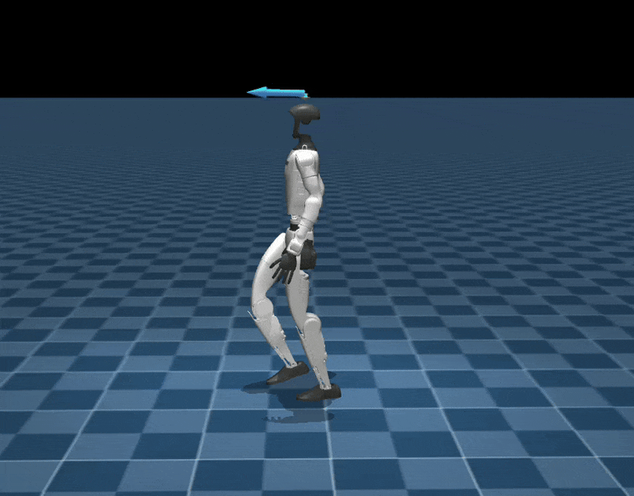
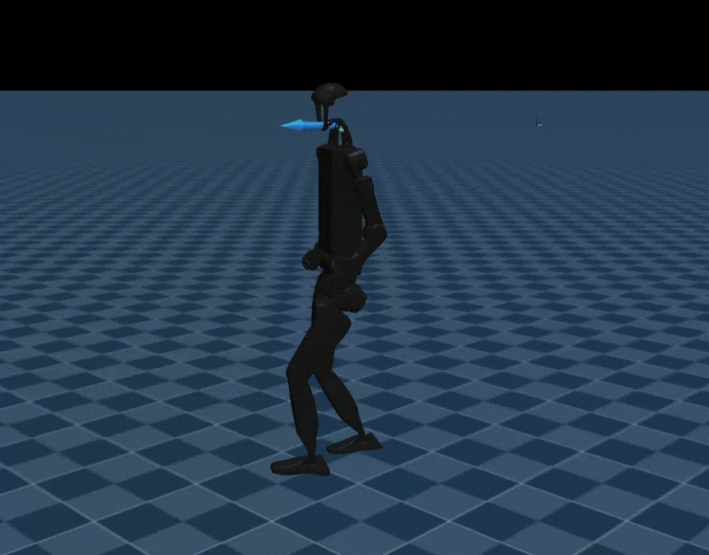
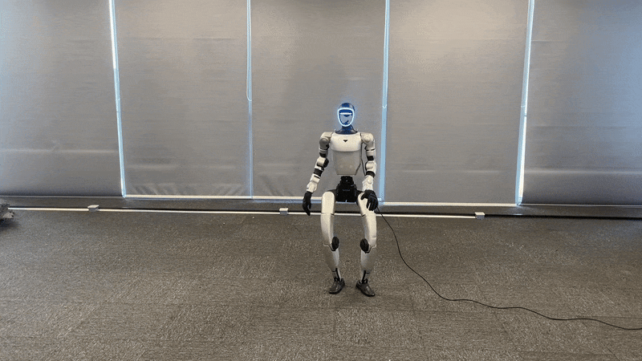

### 1. 速度跟踪训练

运行以下命令进行速度跟踪训练：

```bash
export WANDB_MODE=offline
python scripts/train.py Unitree-G1-Wuji \
  --env.scene.num-envs=4096 \
  --agent.resume=True \
  --agent.load-run=2026-04-29_22-55-05 \
  --agent.load-checkpoint='model_800.pt'

python scripts/train.py Unitree-G1-Wuji --env.scene.num-envs=4096 --gpu-ids ['0,1,2,3'] --gpu-ids=all
python scripts/train.py Unitree-G1-Wuji --env.scene.num-envs=4096 --gpu-ids=all

python scripts/play.py Unitree-G1-Wuji --checkpoint-file=logs/rsl_rl/g1_wuji_manipulation/jiejin/model_800.pt --num-envs=1 --viewer=viser

# 阶段 B：稳定接触训练。使用 Contact 环境，只包含接触相关奖励，不包含右物体阶段移动奖励。
# 前 50 step 只执行冻结的接近策略且不训练 residual，之后训练 residual action。
# 阶段B -- C
--residual-entropy-coef=0.001初始为0.01 -- 0.001
--residual-std-max=1.0初始不做限制 -- 1.0
--agent.algorithm.learning-rate=3e-4初始1e-3  -- 3e-4
关键指尖失败终止为 0.05 m -- 0.03m
KEY_FINGERTIP_TARGET_DISTANCE_PENALTY_WEIGHT = -200.0 -- -50
# 阶段B -- C

python scripts/train.py Unitree-G1-Wuji-Contact \
  --env.scene.num-envs=4096 \
  --residual-base-checkpoint-file=logs/rsl_rl/g1_wuji_manipulation/jiejin/model_12000.pt \
  --residual-base-steps=50 \
  --residual-scale=0.15 \
  --residual-entropy-coef=0.001 \
  --residual-std-max=1.0

python scripts/train.py Unitree-G1-Wuji-Contact \
  --env.scene.num-envs=4096 \
  --residual-base-checkpoint-file=logs/rsl_rl/g1_wuji_manipulation/jiejin/model_12000.pt \
  --residual-base-steps=50 \
  --residual-scale=0.15 \
  --residual-entropy-coef=0.001 \
  --residual-std-max=1.0 \
  --agent.resume=True \
  --agent.load-run=jiechu \
  --agent.load-checkpoint=model_1900.pt

# 阶段 B：播放稳定接触 residual checkpoint。只需要传入固定 base 策略。
python scripts/play.py Unitree-G1-Wuji-Contact \
  --checkpoint-file=logs/rsl_rl/g1_wuji_manipulation/jiechu/model_1900.pt \
  --residual-base-checkpoint-file=logs/rsl_rl/g1_wuji_manipulation/jiejin/model_12000.pt \
  --residual-base-steps=50 \
  --residual-scale=0.15 \
  --num-envs=1 --viewer=viser

# 阶段 A：播放接近策略并采集每个 step 的机器人/物体状态，便于人工判断并筛选成功接近状态。
# 输出文件中包含 initial state + 每步 step 后的 state；只录阶段 A 时 max_steps 设为 base_steps。
python scripts/play.py Unitree-G1-Wuji-Move \
  --agent=zero \
  --residual-base-checkpoint-file=logs/rsl_rl/g1_wuji_manipulation/jiejin/model_12000.pt \
  --residual-base-steps=100 \
  --stage-a-state-output-file=logs/stage_a/play_stage_a_states.pt \
  --stage-a-state-max-steps=100 \
  --num-envs=1 --viewer=viser

# 阶段 A+B：采集完整接近 + 稳定接触后的状态池。后续可筛选末尾稳定接触帧作为 C 的随机 reset 状态池。
python scripts/play.py Unitree-G1-Wuji-Move \
  --agent=zero \
  --residual-base-checkpoint-file=logs/rsl_rl/g1_wuji_manipulation/jiejin/model_12000.pt \
  --residual-contact-checkpoint-file=logs/rsl_rl/g1_wuji_manipulation/jiechu/model_1900.pt \
  --residual-base-steps=30 \
  --residual-contact-steps=50 \
  --residual-contact-scale=0.15 \
  --stage-a-state-output-file=logs/stage_ab/play_stage_ab_states.pt \
  --stage-a-state-max-steps=80 \
  --num-envs=1 --viewer=viser

# 阶段 C：训练新的移动 residual。last30 状态池已经包含 A+B 后的机器人和物体状态；
# right_object_stage_max_waypoint_index：0追第1个点，1追第2个点，2追第3个点，3追第4个点，4追第5个点，5追第6个点，6表示成功
# 长时间不进人下一个waypoint,判为失败
# target 3 抬高一点 到灯嘴处；play的时候 成功之后先把右手拇指食指中指的joint1恢复原位，然后50步之后再重置
# 后续可以增加右物体相对重置时姿态的旋转惩罚 - 物体速度惩罚
python scripts/train.py Unitree-G1-Wuji-Move \
  --env.scene.num-envs=4096 \
  --residual-base-checkpoint-file=logs/rsl_rl/g1_wuji_manipulation/jiejin/model_12000.pt \
  --residual-contact-checkpoint-file=logs/rsl_rl/g1_wuji_manipulation/jiechu/model_1900.pt \
  --residual-base-steps=0 \
  --residual-contact-steps=20 \
  --residual-contact-scale=0.15 \
  --residual-contact-arm-decay-steps=0 \
  --stage-a-init-state-file=logs/stage_ab/play_stage_ab_states_last30.pt \
  --residual-scale=0.5 \
  --residual-left-arm-scale=1.0 \
  --residual-right-arm-scale=2.0 \
  --residual-left-hand-scale=1.0 \
  --residual-right-hand-scale=2.0 \
  --residual-entropy-coef=0.005 \
  --residual-std-max=1.2 \
  --agent.algorithm.learning-rate=1e-4

python scripts/train.py Unitree-G1-Wuji-Move \
  --env.scene.num-envs=4096 \
  --residual-base-checkpoint-file=logs/rsl_rl/g1_wuji_manipulation/jiejin/model_12000.pt \
  --residual-contact-checkpoint-file=logs/rsl_rl/g1_wuji_manipulation/jiechu/model_1900.pt \
  --residual-base-steps=0 \
  --residual-contact-steps=20 \
  --residual-contact-scale=0.15 \
  --residual-contact-arm-decay-steps=0 \
  --stage-a-init-state-file=logs/stage_ab/play_stage_ab_states_last30.pt \
  --residual-scale=0.5 \
  --residual-left-arm-scale=1.0 \
  --residual-right-arm-scale=2.0 \
  --residual-left-hand-scale=1.0 \
  --residual-right-hand-scale=2.0 \
  --residual-entropy-coef=0.005 \
  --residual-std-max=1.2 \
  --agent.algorithm.learning-rate=1e-4 \
  --agent.resume=True \
  --agent.load-run=yidong \
  --agent.load-checkpoint=model_1300.pt 

# 阶段 C：播放移动 residual checkpoint。需要同时传入固定 base 和 contact 策略。
python scripts/play.py Unitree-G1-Wuji-Move \
  --checkpoint-file=logs/rsl_rl/g1_wuji_manipulation/yidong/model_2100.pt \
  --residual-base-checkpoint-file=logs/rsl_rl/g1_wuji_manipulation/jiejin/model_12000.pt \
  --residual-contact-checkpoint-file=logs/rsl_rl/g1_wuji_manipulation/jiechu/model_1900.pt \
  --residual-base-steps=25 \
  --residual-contact-steps=20 \
  --residual-contact-scale=0.15 \
  --residual-contact-arm-decay-steps=0 \
  --residual-scale=0.5 \
  --residual-left-arm-scale=1.0 \
  --residual-right-arm-scale=2.0 \
  --residual-left-hand-scale=1.0 \
  --residual-right-hand-scale=2.0 \
  --num-envs=1 --viewer=viser

# manipulation 训练会额外保存并覆盖当前最高 Mean reward 的 checkpoint：
# logs/rsl_rl/g1_wuji_manipulation/<run>/model_best.pt

python scripts/list_envs.py

python scripts/manual_scene_view.py Unitree-G1-Wuji --num-envs 1
```

## 奖励设计
阶段 A：base 冻结，只接近目标点
阶段 B：residual 只学稳定接触，物体不许动
阶段 C：稳定接触 gate 解锁后，再学右物体阶段移动 

```text
if t < T_base:
  final_action = base_action

elif T_base <= t < T_base + T_contact:
  final_action = cached_base_action + scale_B * frozen_contact_residual
  cached_contact_action = final_action

else:
  arm_decay = linear_decay(1 -> 0, steps=contact_arm_decay_steps)
  contact_reference = cached_contact_action
  contact_reference[shoulder/elbow/wrist] *= arm_decay
  final_action = contact_reference + scale_C * group_scale * trainable_move_residual
```

只有 `else` 里的 `trainable_move_residual` 参与 PPO 更新。base 策略和 contact 策略都只做冻结推理。`--residual-contact-arm-decay-steps` 只作用于阶段 C 的 cached contact action：肩/肘/腕会从接触姿态参考线性衰减到 0，手指不衰减，用于保持抓握接触；默认 `0` 表示关闭该衰减并保持旧行为。`group_scale` 只作用于阶段 C 的可训练 move residual：可用 `--residual-left-arm-scale`、`--residual-right-arm-scale`、`--residual-left-hand-scale`、`--residual-right-hand-scale` 分别控制左右肩/肘/腕和左右手指；不传左右参数时回退到旧的 `--residual-arm-scale`、`--residual-hand-scale`，其他关节使用 `--residual-other-scale`。推荐移动阶段先让右臂大、左臂小：右臂负责移动右物，左侧主要保持稳定。


### 接近环境：只训练手部到达目标点
主要生效奖励为：
```text
hand_internal =
  HAND_INTERNAL_CORE_REWARD_WEIGHT
  * (
      fingertip_wrist_alignment
      * joint_velocity_smoothness
      * joint_acceleration_smoothness
      * action_rate_smoothness
      * action_acceleration_smoothness
      * action_magnitude_smoothness
    )
  + joint_site_alignment_primary
  + joint_site_alignment_secondary
  + site_height_penalty
  + object_sdf_penalty
  + joint_limit_penalty
  + palm_ground_penalty
```

其中：
- `fingertip_wrist_alignment`：指尖和手腕到对应目标 site 的对齐奖励，使用 `exp(-scale * distance)` 后相乘。
- `joint_velocity_smoothness`：关节速度平滑项，使用 `exp(-scale * ||qdot||)`。
- `joint_acceleration_smoothness`：关节加速度平滑项，使用 `exp(-scale * ||qacc||)`。
- `action_rate_smoothness`：动作一阶差分平滑项，使用 `exp(-scale * ||a_t - a_{t-1}||)`。
- `action_acceleration_smoothness`：动作二阶差分平滑项，使用 `exp(-scale * ||a_t - 2a_{t-1} + a_{t-2}||^2)`。
- `action_magnitude_smoothness`：动作幅值平滑项，使用 `exp(-scale * sum(a_t^2))`。
- `joint_site_alignment_primary`：拇指、食指、中指的 `joint1/joint3/joint4` site 对齐奖励。
- `joint_site_alignment_secondary`：无名指、小指的 `joint1/joint3/joint4` site 对齐奖励。
- `site_height_penalty`：拇指、食指、中指的指尖和 joint134 site 低于对应目标 site 时的线性惩罚。
- `object_sdf_penalty`：基于 STL SDF 的虚拟穿透惩罚，前期更强，接近后减弱。
- `joint_limit_penalty`：关节超过 soft limit 的惩罚。
- `palm_ground_penalty`：手掌接触地面的惩罚。

当前接近环境的 `Episode_Reward` 只打印左右手各自的上述项，不包含接触图、物体阶段移动、接触力方向、合力、力矩、相对速度或相对位置奖励。

### 接触环境：`Unitree-G1-Wuji-Contact`
该环境只用于阶段 B，奖励始终保留阶段 A 的左右 `hand_internal` 接近奖励，并额外加入稳定接触相关奖励；不加入右物体阶段移动奖励。

动作机制：
```text
if t < residual_base_steps:
  final_action_t = base_action_t
else:
  final_action_t = cached_base_action + residual_scale * contact_residual_t
```

`base_action_t` 来自冻结的接近策略，例如 `logs/rsl_rl/g1_wuji_manipulation/jiejin/model_12000.pt`。只有 `contact_residual_t` 会参与 PPO 更新，base 阶段不参与训练。

接触环境奖励包括阶段 A 的：
- `left_hand_internal`
- `right_hand_internal`

以及阶段 B 额外的：
- `left_contact_graph`：左手 5 指目标接触图 exp 奖励，目标为 thumb/index 接触、middle/ring/little 不接触。
- `right_contact_graph`：右手 5 指目标接触图 exp 奖励，目标为 thumb/index/middle 接触、ring/little 不接触。
- `left_key_fingertip_force` / `right_key_fingertip_force`：关键指尖接触力奖励。
- `key_fingertip_target_distance`：关键指尖保持惩罚，防止接触 residual 把关键指尖带离目标点。
- `contact_move_object_regularization`：稳定接触阶段的物体正则，抑制左右物体明显移动、抬起或高速运动。阶段 B 分解为三项：`contact_move_left_object_stability` 表示左物体稳定惩罚，包含左物体线速度、角速度、水平位移和抬起；`contact_move_right_object_stability` 表示右物体稳定惩罚，包含右物体线速度、角速度和水平位移；`contact_move_right_lift` 表示右物体抬起惩罚，用于避免接触阶段把右物体顶起或打飞。
- `contact_move_relative_pose`：左右手分别满足各自稳定接触 gate 后，分别奖励关键手指和本侧物体保持相对位姿。左手 gate 要求 thumb/index 同时进入各自目标接触点 `0.02 m` 内并且存在指尖-物体接触力；右手 gate 要求 thumb/index/middle 同时满足同样条件。每侧 gate 都需要连续保持 `RIGHT_OBJECT_STAGE_ACTIVATION_HOLD_STEPS = 10` step 后才解锁本侧相对位姿缓存和奖励。

### 移动环境：`Unitree-G1-Wuji-Move`
该环境只用于阶段 C，奖励始终保留阶段 A 的左右 `hand_internal` 接近奖励，并在接触保持奖励基础上额外加入右物体阶段移动奖励。

动作机制：
```text
if t < residual_base_steps:
  final_action_t = base_action_t
elif t < residual_base_steps + residual_contact_steps:
  final_action_t = cached_base_action + residual_contact_scale * contact_residual_t
  cached_contact_action = final_action_t
else:
  arm_decay_t = linear_decay(1 -> 0, steps=residual_contact_arm_decay_steps)
  contact_reference_t = cached_contact_action_t
  contact_reference_t[shoulder/elbow/wrist] *= arm_decay_t
  final_action_t = contact_reference_t + residual_scale * move_residual_t
```

`base_action_t` 来自冻结的接近策略，例如 `logs/rsl_rl/g1_wuji_manipulation/jiejin/model_12000.pt`。`contact_residual_t` 来自冻结的阶段 B 接触策略，例如 `logs/rsl_rl/g1_wuji_manipulation/jiechu/model_1900.pt`。只有第三段的 `move_residual_t` 会参与 PPO 更新，前两段动作只用于把环境带到接触后的起始状态。阶段 C 可用 `--residual-contact-arm-decay-steps=50` 让肩/肘/腕的接触参考在 50 step 内衰减到 0，避免冻结接触姿态持续把手臂拉回原位；手指参考仍保留。

移动环境奖励包括阶段 A 的：
- `left_hand_internal`
- `right_hand_internal`

以及阶段 C 额外的：
- `left_contact_graph`：左手 5 指目标接触图 exp 奖励，目标为 thumb/index 接触、middle/ring/little 不接触。
- `right_contact_graph`：右手 5 指目标接触图 exp 奖励，目标为 thumb/index/middle 接触、ring/little 不接触。
- `left_key_fingertip_force` / `right_key_fingertip_force`：关键指尖接触力奖励。只统计目标接触图中为 1 的手指，用于给“产生接触力”更密集的正反馈。
- `key_fingertip_target_distance`：关键指尖保持惩罚。左手 thumb/index、右手 thumb/index/middle 距离各自目标 site 超过 2cm 后开始强惩罚，避免阶段 B/C 把手带离目标点。
- `contact_move_object_regularization`：移动阶段的物体正则。右物体允许移动，不再计算右物体稳定/抬起惩罚；左物体始终尽量不动。阶段 C 会分解打印 `contact_move_left_object_stability` 和 `contact_move_right_speed`，其中 `contact_move_right_speed` 只在右物体线速度或角速度超过上限时惩罚，不鼓励右物体静止。
- `contact_move_relative_pose`：左右手分别满足各自稳定接触 gate 后，分别缓存本侧关键手指的指尖和 `joint1/joint3/joint4` site 相对本侧物体的位置；后续移动阶段分别奖励保持本侧相对位姿。
- `right_object_stage`：右物体按 target1 -> target2 -> target3 的阶段移动奖励，只有右手移动 gate 连续满足后才生效。

`left_contact_graph` / `right_contact_graph` 计算方式：
```text
contact_i = 1{ ||fingertip_i - target_site_i|| < CONTACT_GRAPH_DISTANCE_THRESHOLD
               and contact_force_i > FINGERTIP_OBJECT_CONTACT_FORCE_THRESHOLD }

target_left  = [1, 1, 0, 0, 0]
target_right = [1, 1, 1, 0, 0]

total_cg_error = sum_i |contact_i - target_i|
reward = exp(-CONTACT_GRAPH_EXP_SCALE * total_cg_error)
```
也就是 5 个手指都进入误差：目标接触的手指没接触会降低奖励，目标不接触的手指发生目标点接触也会降低奖励。完全符合目标接触图时奖励为 1。当前 `CONTACT_GRAPH_EXP_SCALE = 1.0`，误差为 1/2/3 时奖励约为 0.37/0.14/0.05，避免阶段 B 接触奖励一开始全部接近 0。

`left_key_fingertip_force` / `right_key_fingertip_force` 计算方式：
```text
key_force_sum = sum(||force_i||), i 属于目标接触图中为 1 的关键指尖
reward = exp(-KEY_FINGERTIP_FORCE_EXP_SCALE / (key_force_sum + 1e-5))
```
该项只鼓励关键指尖产生接触力；接触位置和非目标手指是否误接触仍由 `contact_graph` 约束。

`key_fingertip_target_distance` 计算方式：
```text
left_key  = left thumb/index
right_key = right thumb/index/middle

violation_i = max(||fingertip_i - target_site_i|| - 0.02, 0)
penalty = KEY_FINGERTIP_TARGET_DISTANCE_PENALTY_WEIGHT * sum_i violation_i^2
```
该项阶段 B/C 都生效，用来约束 residual 不要为了接触或移动而让关键指尖远离目标点。当前权重为 `KEY_FINGERTIP_TARGET_DISTANCE_PENALTY_WEIGHT = -200.0`。

`contact_move_relative_pose` 计算方式：
```text
left_gate  = 左手 thumb/index 同时满足 near + 接触力
right_gate = 右手 thumb/index/middle 同时满足 near + 接触力

每侧 gate 连续满足 RIGHT_OBJECT_STAGE_ACTIVATION_HOLD_STEPS = 10 step 时，分别缓存：
  left_ref  = left_key_hand_sites  - left_obj_root，表达在 left_obj 坐标系
  right_ref = right_key_hand_sites - right_obj_root，表达在 right_obj 坐标系

之后每个 step：
  left_reward  = exp(-CONTACT_MOVE_RELATIVE_POSE_EXP_SCALE * left_rel_error)
  right_reward = exp(-CONTACT_MOVE_RELATIVE_POSE_EXP_SCALE * right_rel_error)
  reward = 0.5 * (left_reward + right_reward)
```
这里的 key hand sites 包括关键手指的 `joint1/joint3/joint4` site 和 fingertip site。该项让右物体移动时手指跟物体保持抓稳关系；左物体虽然不希望移动，但左手相对左物体的位置同样被约束。

稳定接触 gate 的具体条件：
```text
左手 gate：
  left thumb/index 同时满足：
    ||fingertip_i - target_contact_site_i|| < RIGHT_OBJECT_STAGE_ACTIVATION_THRESHOLD
    fingertip_object_contact_force_i > FINGERTIP_OBJECT_CONTACT_FORCE_THRESHOLD

右手 gate：
  right thumb/index/middle 同时满足：
  ||fingertip_i - target_contact_site_i|| < RIGHT_OBJECT_STAGE_ACTIVATION_THRESHOLD
  fingertip_object_contact_force_i > FINGERTIP_OBJECT_CONTACT_FORCE_THRESHOLD

每侧 gate 独立判断，分别连续保持 RIGHT_OBJECT_STAGE_ACTIVATION_HOLD_STEPS step 后，分别解锁本侧相对位姿奖励。
```
当前配置中，距离阈值为 `0.02 m`，接触力阈值为 `0.0`，保持步数为 `10`。

稳定接触 gate 的作用：
- 在 `Unitree-G1-Wuji-Contact` 中，左右手 gate 分别决定什么时候缓存本侧手指-物体相对位姿，之后奖励本侧持续稳定接触。
- 在 `Unitree-G1-Wuji-Move` 中，左右手相对位姿仍分别保持；`right_object_stage` 的移动奖励解锁仍只看右手 gate，因为右物体移动由右手负责。

阶段 B/C 的终止设计：
- 右物体旋转不再作为失败终止。右物体允许在接触/移动学习中发生旋转，旋转质量主要由物体稳定正则和后续移动目标约束。
- 左物体仍保留旋转失败终止，因为左物体目标是尽量保持稳定。
- 新增 `key_fingertip_target_distance_failure`：该终止只在可训练 residual 阶段开始后生效，启用步数会自动跟随 `--residual-base-steps + --residual-contact-steps`。之后左手 thumb/index、右手 thumb/index/middle 任一关键指尖距离目标 site 超过 `0.05 m`，直接判定失败。

`contact_move_object_regularization` 计算方式：
```text
left_penalty =
  w_lin  * max(||left_obj_lin_vel|| - v_tol, 0)^2
  + w_ang * max(||left_obj_ang_vel|| - w_tol, 0)^2
  + w_xy  * max(||left_obj_xy - left_obj_xy_init|| - xy_tol_left, 0)
  + w_z   * max(left_obj_z - left_obj_z_init - z_tol, 0)

right_penalty =
  w_lin  * max(||right_obj_lin_vel|| - v_tol, 0)^2
  + w_ang * max(||right_obj_ang_vel|| - w_tol, 0)^2
  + w_xy  * max(||right_obj_xy - right_obj_xy_init|| - xy_tol_right, 0)
  + w_z   * max(right_obj_z - right_obj_z_init - z_tol, 0)
```

阶段 B/C 相关日志含义：
- `Episode_Reward/contact_move_left_object_stability`：阶段 B/C 都生效。左物体稳定惩罚，包含左物体线速度、角速度、水平位移和抬起惩罚；越接近 0 越好，说明左物体基本没有明显移动。
- `Episode_Reward/contact_move_right_speed`：阶段 C 中右物体速度上限惩罚。右物体线速度低于 `RIGHT_OBJECT_MOVE_LINEAR_VELOCITY_LIMIT`、角速度低于 `RIGHT_OBJECT_MOVE_ANGULAR_VELOCITY_LIMIT` 时该项为 0；只有速度过快才变成负值，用于防止打飞/高速旋转，不惩罚正常移动。
- `Episode_Reward/contact_move_right_object_stability`：只在阶段 B 打印并生效。右物体稳定惩罚，包含右物体线速度、角速度和水平位移惩罚；用于让阶段 B 先学稳定接触，不要推走右物体。
- `Episode_Reward/contact_move_right_lift`：只在阶段 B 打印并生效。右物体抬起惩罚，用于避免接触阶段把右物体顶起或打飞；阶段 C 因为需要移动右物体，不计算该项。
- `Episode_Reward/contact_move_relative_pose_left`：左手关键手指相对左物体位姿保持奖励。
- `Episode_Reward/contact_move_relative_pose_right`：右手关键手指相对右物体位姿保持奖励。

`contact_move_object_regularization` 是物体正则总项，已经由 `contact_move_left_object_stability`、`contact_move_right_speed`、`contact_move_right_object_stability`、`contact_move_right_lift` 分解显示，因此不再重复打印总项。`contact_move_relative_pose` 同理，只打印左右分解项，不再重复打印总项。

### 阶段 C 打开后，`right_object_stage` 计算方式：
```text
gate = 右手 thumb/index/middle 同时满足距离阈值和接触力阈值
gate 连续保持 RIGHT_OBJECT_STAGE_ACTIVATION_HOLD_STEPS = 10 step 后解锁阶段奖励；解锁后不再要求每个 step 都持续满足完整 gate，接触保持由 contact_graph、key_fingertip_force、key_fingertip_target_distance 和 contact_move_relative_pose 约束

路径点：
  begin -> target1 插入 3 个中间点
  target1 -> target2 插入 2 个中间点
  target2 -> target3 插入 1 个中间点

因此总 waypoint 数为 9：
  [interp_1_1, interp_1_2, interp_1_3, target1,
   interp_2_1, interp_2_2, target2,
   interp_3_1, target3]

p = 已完成 waypoint 数，当前目标为 waypoint_p
d_p = ||current_right_obj_position_begin - waypoint_p||
height_error = |world_z(current_right_obj_position_begin) - world_z(waypoint_p)|
begin = 右手移动 gate 解锁时缓存的 right_obj moving site world position

当前 segment 为：
  segment_start = begin                    if p == 0
  segment_start = waypoint_{p-1}           if p > 0
  segment_end   = waypoint_p

沿当前 segment 的投影进度：
  q = current_right_obj_position_begin
  u = segment_end - segment_start
  progress = clamp(dot(q - segment_start, u) / ||u||^2, 0, 1)
  q_proj = segment_start + progress * u
  lateral = ||q - q_proj||

progress_reward = progress * exp(-RIGHT_OBJECT_STAGE_SEGMENT_EXP_SCALE * lateral)
waypoint_reward = exp(-scale_p * d_p)

z_start = world_z(segment_start)
z_target = world_z(segment_end)
z_current = world_z(current_right_obj_position_begin)
height_progress =
  clamp((z_current - z_start) / (z_target - z_start), 0, 1)      if z_target >= z_start
  clamp((z_start - z_current) / (z_start - z_target), 0, 1)      if z_target < z_start
height_track = exp(-RIGHT_OBJECT_STAGE_HEIGHT_EXP_SCALE * height_error)
height_reward =
  RIGHT_OBJECT_STAGE_HEIGHT_PROGRESS_MIX * height_progress
  + RIGHT_OBJECT_STAGE_HEIGHT_TRACK_MIX * height_track

dense_reward =
  RIGHT_OBJECT_STAGE_SEGMENT_REWARD_WEIGHT * progress_reward
  + RIGHT_OBJECT_STAGE_WAYPOINT_REWARD_WEIGHT * waypoint_reward
  + RIGHT_OBJECT_STAGE_HEIGHT_REWARD_WEIGHT * height_reward
progress_bonus =
  RIGHT_OBJECT_STAGE_PASSED_WAYPOINT_REWARD_WEIGHT * p

stage_reward =
  0                     if 未解锁
  (progress_bonus + dense_reward) / 9
  stage_reward_max      if 已完成 target3
```
其中 `stage_reward_max = segment_weight + waypoint_weight + height_weight`。每个 segment 都只使用自己的 `segment_start -> segment_end` 方向计算投影进度，因此 begin 到 target1、target1 到 target2、target2 到 target3 的方向可以不同，不会用最终 target3 的方向替代前面阶段。`progress_reward` 不再乘高度 gate，横向进度和高度目标独立给奖励。

当前 dense reward 权重为 `10/10/30`，即 `segment_progress / waypoint_exp / height_reward`。通过 waypoint 后的历史进度只给小额 bonus，当前为 `RIGHT_OBJECT_STAGE_PASSED_WAYPOINT_REWARD_WEIGHT = 3.0`；这样避免策略短暂碰到 waypoint 后放下仍持续拿大额奖励。这些权重不强制相加为 1，且 `right_object_stage` 不再额外乘全局阶段权重；如果移动奖励太弱或太强，直接调这些子项权重。

阶段 C 会额外打印三个分解项：
- `Episode_Reward/right_object_stage_segment_progress`：沿当前 segment 方向的投影进度奖励。
- `Episode_Reward/right_object_stage_waypoint_exp`：靠近当前 waypoint 的指数距离奖励。
- `Episode_Reward/right_object_stage_height_reward`：当前右物体移动 site 的 world-z 高度奖励，等于“朝当前 waypoint 高度前进”和“贴近当前 waypoint 高度”的加权和；超过当前目标高度不会继续增加奖励。

插值配置为 `RIGHT_OBJECT_STAGE_INTERP_COUNTS = (3, 2, 1)`。每个 waypoint 的推进阈值沿用所在阶段的阈值：begin->target1 段使用 `0.03 m`，target1->target2 段使用 `0.02 m`，target2->target3 段使用 `0.01 m`。target3 距离 `0.01 m` 内完成后触发 `right_object_stage_success`。


### 2. 动作模仿训练

训练 Unitree G1 模仿参考动作序列。

<div style="margin-left: 20px;">

#### 2.1 准备动作文件

将准备好的 csv 格式的动作文件保存在 mjlab/motions/g1/ 目录下，执行下面的指令将其转为训练可用的 npz 文件：

```bash
python scripts/csv_to_npz.py \
--input-file src/assets/motions/g1/dance1_subject2.csv \
--output-name dance1_subject2.npz \
--input-fps 30 \
--output-fps 50 \
--robot g1 # g1 or g1_23dof
```

**npz文件默认保存路径为**：`src/motions/g1/...`

#### 2.2 训练

确保有可用的npz文件之后，执行以下指令进行训练：

```bash
python scripts/train.py Unitree-G1-Tracking-No-State-Estimation --motion_file=src/assets/motions/g1/dance1_subject2.npz --env.scene.num-envs=4096
```

可用任务:
  - Unitree-G1-Tracking-No-State-Estimation
  - Unitree-G1-23Dof-Tracking-No-State-Estimation

</div>

> [!NOTE]
> 有关动作模仿训练的详细说明，请参阅BeyondMimic 文档
> [BeyondMimic documentation](https://github.com/HybridRobotics/whole_body_tracking/blob/main/README.md#motion-preprocessing--registry-setup).

#### ⚙️  参数说明
- `--env.scene`: 仿真场景配置，包括环境数量（num_envs）、物理仿真步长、地面类型、重力、随机扰动等参数。
- `--env.observations`: 观测空间配置，控制训练时输入到策略网络的状态信息，如关节位置、速度、IMU等内容。
- `--env.rewards`: 奖励函数配置，定义每步训练时的优化目标。
- `--env.commands`: 控制命令配置，用于生成训练时随机或指定的速度 / 姿态 / 动作指令。
- `--env.terminations`: 终止条件配置，定义训练 episode 的结束条件。
- `--agent.seed`: 训练随机种子，用于结果复现，不同 seed 会导致策略略有差异。
- `--agent.resume`: 是否从上次中断的 checkpoint 继续训练。 设置为 True 时，会自动加载最近一次保存的 .pt 模型文件。
- `--agent.policy`: 策略网络结构配置，例如 MLP 层数、隐藏维度、激活函数等。
- `--agent.algorithm`: 强化学习算法配置。可设置优化超参数，如学习率、批量大小、GAE λ 等。

**默认保存训练结果**：`logs/rsl_rl/<robot>_(velocity | tracking)/<date_time>/model_<iteration>.pt`

### 3. 仿真验证

如果想要在 MuJoCo 中查看训练效果，可以运行以下命令：

查看速度跟踪训练效果：
```bash
python scripts/play.py Unitree-G1-Flat --checkpoint_file=logs/rsl_rl/g1_velocity/2026-xx-xx_xx-xx-xx/model_xx.pt
```

查看动作模仿训练效果：
```bash
python scripts/play.py Unitree-G1-Tracking-No-State-Estimation --motion_file=src/assets/motions/g1/dance1_subject2.npz --checkpoint_file=logs/rsl_rl/g1_tracking/2026-xx-xx_xx-xx-xx/model_xx.pt
```

**说明**：

- 训练时在每次保存模型时会同步导出 policy.onnx 文件在同层目录下，可用于实物部署。

**效果**：

| G1                             | H1_2                               | G1_mimic                          |
|--------------------------------|------------------------------------|-----------------------------------|
|  |  |  |

### 4. 实物部署

实物部署前先确保主机安装了下列通信工具：
- [cyclonedds](https://github.com/eclipse-cyclonedds/cyclonedds.git)
- [unitree_sdk2](https://github.com/unitreerobotics/unitree_sdk2.git)

<div style="margin-left: 20px;">

#### 4.1 启动机器人
将机器人在吊装状态下启动，并等待机器人进入 `零力矩模式`

#### 4.2 进入调试模式
确保机器人处于 `零力矩模式` 的情况下，按下遥控器的 `L2+R2`组合键；此时机器人会进入`调试模式`, `调试模式`下机器人关节处于阻尼状态。

#### 4.3 连接机器人
使用网线连接电脑与机器人网口，并修改网络配置如下：
- 地址：`192.168.123.222`
- 子网掩码：`255.255.255.0`

然后使用 `ifconfig` 命令查看与机器人连接的网卡名称，记录后用于启动参数。

#### 4.4 编译
以 Unitree G1 速度控制为例（其他机器人同理）。
将策略文件（`policy.onnx`）放入`deploy/robots/g1/config/policy/velocity/vo/exported` 下，然后执行：

```bash
cd deploy/robots/g1
mkdir build && cd build
cmake .. && make
```

#### 4.5 部署

## 4.5.1 仿真部署

在实物部署前，建议使用[unitree_mujoco](https://github.com/unitreerobotics/unitree_mujoco)进行仿真部署，防止实物机器人出现异常动作。本框架已将其集成。

编译unitree_mujoco：

```bash
cd simulate
mkdir build && cd build
cmake .. && make -j8
```

启动仿真器(注意此处需连接上手柄才能启动)：

```bash
./simulate/build/unitree_mujoco
```

可在 `simulate/config` 中选择对应机器人

启动仿真控制程序：

```bash
cd deploy/robots/g1/build
./g1_ctrl --network=lo
```

## 4.5.2 实物部署

启动实物控制程序：

```bash
cd deploy/robots/g1/build
./g1_ctrl --network=enp5s0
```

**参数说明**：
- `network`: 连接机器人网卡名称，仿真部署使用 `lo`，实物机器人如 `enp5s0`(可使用 `ifconfig` 指令查看)

</div>

**实物效果**：

| G1                                                    | H1_2                                                    | G1_mimic                                           |
|-------------------------------------------------------|---------------------------------------------------------|----------------------------------------------------|
|  |  |  |


## 🎉  致谢

本仓库开发离不开以下开源项目的支持与贡献，特此感谢：

- [mjlab](https://github.com/mujocolab/mjlab.git): 构建训练与运行代码的基础。
- [whole_body_tracking](https://github.com/HybridRobotics/whole_body_tracking.git): 用于动作跟踪的通用人形机器人控制框架。
- [rsl_rl](https://github.com/leggedrobotics/rsl_rl.git): 强化学习算法实现。
- [mujoco_warp](https://github.com/google-deepmind/mujoco_warp.git): 提供 GPU 加速渲染与仿真接口。
- [mujoco](https://github.com/google-deepmind/mujoco.git): 提供强大仿真功能。
